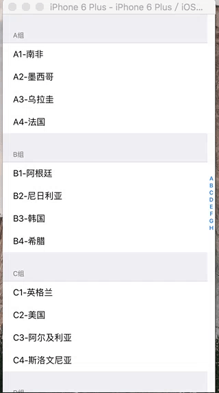

# iOS TableView Index Sample

TableView分组和索引显示实战示例，基于语言Swift2.2，环境XCode7.3.1

本工程在[简单TableView示例](https://github.com/zhuifengshen/iOSTableViewSample)上增加了对列表项进行分类和添加索引进行快速查询，具体运行情况如下：

### 实现分组和索引功能要点：
* 实现UITableViewDataSource协议方法tableView:numberOfRowsInSection:返回分组个数；
* 实现UITableViewDataSource协议方法tableView:numberOfSectionsInTableView:返回各个分组中列表项的个数；
* 实现UITableViewDataSource协议方法tableView:titleForHeaderInSection:返回各个分组的标题；
* 实现UITableViewDataSource协议方法tableView:cellForRowAtIndexPath:显示各个列表项的内容；
* 实现UITableViewDataSource协议方法sectionIndexTitlesForTableView:返回索引数组；

如果喜欢的话，欢迎**Start**一下
